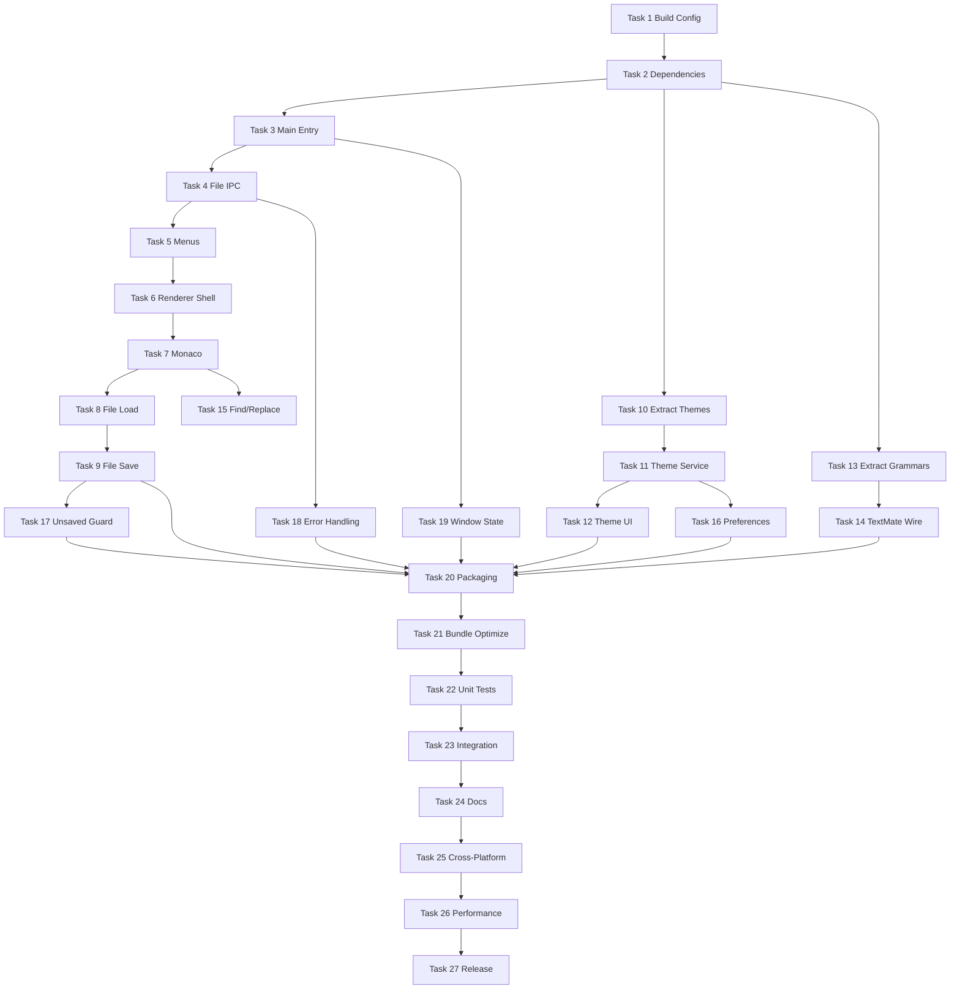

# Minimal Editor — Master Implementation Plan

> **For agentic workers:** REQUIRED SUB-SKILL: Use superpowers:subagent-driven-development (recommended) or superpowers:executing-plans to implement phase plans task-by-task. Steps use checkbox (`- [ ]`) syntax for tracking.

**Goal:** Transform VS Code into a minimal, fast, cross-platform notepad powered by Monaco — startup < 1000ms, memory < 100MB (empty file), no extensions/terminal/git/debug.

**Architecture:** Separate Electron app with three entry points (`minimal-main`, `minimal-preload`, `minimal-renderer`), esbuild bundling to `out-minimal/`, IPC for file ops, Monaco standalone + TextMate grammars + bundled VS Code themes. Does **not** reuse VS Code workbench — new thin shell alongside existing codebase.

**Tech Stack:** Electron 28+, Monaco Editor 0.45+, esbuild, onigasm/monaco-textmate/vscode-textmate, electron-builder, TypeScript 5.3+, Mocha/Chai (unit), Playwright (integration).

## Global Constraints

- Startup window visible and editor interactive within **1000ms** (quad-core, 8GB RAM, SSD)
- Memory: **< 100MB** empty file, **< 200MB** for 10K-line file
- File open (< 1MB): **< 200ms**; theme switch: **< 100ms**
- **No** telemetry, extension system, Git, terminal, debugger, multi-file search, LSP/IntelliSense, settings UI, workspace/multi-root, remote dev, webviews, activity bar, side panels
- Supported extensions for syntax: `c, js, md, txt, json, html, css, py, java, cpp, rs, go, ts, jsx, tsx, xml, yaml, sql, sh, bat, php, rb, swift, kt`
- Config dir: `~/.config/minimal-editor/` (Linux), `%APPDATA%/MinimalEditor` (Win), `~/Library/Application Support/MinimalEditor` (macOS)
- App ID: `com.minimal.editor`; output: `out-minimal/`, dist: `dist-minimal/`
- Native menus (File/Edit/View), native file dialogs, platform shortcuts (Ctrl vs Cmd)

---

## Current Status (2026-08-23)

| Task | Description | Status |
|------|-------------|--------|
| 1 | Build configuration | **Partial** — `build/minimal.config.cjs`, validation scripts exist; missing `gulpfile.minimal.ts`, `package-minimal.json` |
| 2–27 | All other tasks | **Not started** — no `src/minimal-*.ts`, no `resources/index.html` |

**Verified working today:**
```bash
node build/validate-minimal-config.cjs   # exit 0
node build/test-minimal-config.cjs       # exit 0, 15/15 pass
```

---

## Phase Plans

Execute in order. Each phase plan is self-contained with TDD steps, exact paths, and commit boundaries.

| Phase | Plan File | Tasks | Est. |
|-------|-----------|-------|------|
| 1 | [phase-01-build-infrastructure.md](./2026-08-23-minimal-editor-phase-01-build-infrastructure.md) | 1–2 | 1 day |
| 2 | [phase-02-main-process.md](./2026-08-23-minimal-editor-phase-02-main-process.md) | 3–5 | 2 days |
| 3 | [phase-03-renderer-monaco.md](./2026-08-23-minimal-editor-phase-03-renderer-monaco.md) | 6–9 | 3 days |
| 4 | [phase-04-themes.md](./2026-08-23-minimal-editor-phase-04-themes.md) | 10–12 | 2 days |
| 5 | [phase-05-syntax-highlighting.md](./2026-08-23-minimal-editor-phase-05-syntax-highlighting.md) | 13–14 | 2 days |
| 6 | [phase-06-editor-features.md](./2026-08-23-minimal-editor-phase-06-editor-features.md) | 15–16 | 1 day |
| 7 | [phase-07-polish.md](./2026-08-23-minimal-editor-phase-07-polish.md) | 17–19 | 1 day |
| 8 | [phase-08-packaging.md](./2026-08-23-minimal-editor-phase-08-packaging.md) | 20–21 | 2 days |
| 9–10 | [phase-09-10-testing-release.md](./2026-08-23-minimal-editor-phase-09-10-testing-release.md) | 22–27 | 4 days |

**Total:** 27 tasks, ~15–20 days

---

## Dependency Graph



---

## Requirements Coverage Map

| Req | Topic | Phase / Task |
|-----|-------|--------------|
| R1 | Core editor (Monaco, line nums, wrap, undo) | Phase 3: T7, T16 |
| R2 | File ops (new/open/save/save-as, dirty) | Phase 2–3: T4, T8, T9, T17 |
| R3 | File type detection | Phase 3: T8; Phase 5: T14 |
| R4 | Themes (pre-installed, persist) | Phase 4: T10–12 |
| R5 | Find/replace in file | Phase 6: T15 |
| R6 | Native menus | Phase 2: T5 |
| R7 | Performance targets | Phase 8: T21; Phase 9–10: T26 |
| R8 | Feature removal (by omission) | All — no workbench code imported |
| R9 | Cross-platform desktop | Phase 2: T5; Phase 8: T20; Phase 9–10: T25 |
| R10 | UI simplification | Phase 3: T6 (HTML shell only) |
| R11 | Basic formatting (indent, comments) | Phase 3: T7 (Monaco defaults) |
| R12 | Window management | Phase 2: T3; Phase 7: T19 |

---

## File Structure (Target)

```
build/
  minimal.config.cjs          # exists
  gulpfile.minimal.ts         # Phase 1
  validate-minimal-config.cjs # exists
  test-minimal-config.cjs     # exists
package-minimal.json          # Phase 1
electron-builder.json         # Phase 8
src/
  minimal-main.ts             # Phase 2
  minimal-preload.ts
  minimal-config.ts
  minimal-file-service.ts
  minimal-menu.ts
  minimal-renderer.ts         # Phase 3
  language-detection.ts
  monaco-config.ts
  theme-service.ts            # Phase 4
  theme-converter.ts
  theme-selector.ts
  grammar-service.ts          # Phase 5
  error-handler.ts            # Phase 7
resources/
  index.html
  styles.css
  themes/                     # extracted
  grammars/                   # extracted
  icon.{icns,ico,png}
scripts/
  extract-themes.js
  extract-grammars.js
test/
  unit/
  integration/
out-minimal/                  # build output
dist-minimal/                 # packaged apps
```

---

## Execution Handoff

After reading this index, open **Phase 1** plan and begin Task 1 Step 1 (finish gulp pipeline).

**Two execution options:**

1. **Subagent-Driven (recommended)** — dispatch fresh subagent per task, two-stage review between tasks
2. **Inline Execution** — run tasks in-session via executing-plans with batch checkpoints

**Which approach?**
