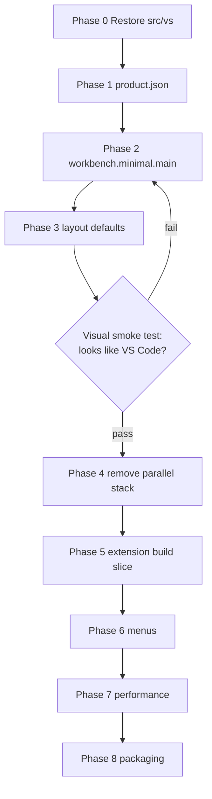

# Minimal Editor — Workbench Pivot (Master Plan)

> **For agentic workers:** REQUIRED SUB-SKILL: Use superpowers:subagent-driven-development (recommended) or superpowers:executing-plans to implement phase plans task-by-task. Steps use checkbox (`- [ ]`) syntax for tracking.

**Goal:** Deliver a minimal notepad that **looks and feels like VS Code** (themes, editor chrome, find widget, codicons, workbench CSS) while meeting `.kiro/specs/minimal-editor/requirements.md` performance and feature-removal targets — by **subtracting from VS Code**, not rebuilding beside it.

**Architecture:** Restore and boot the real VS Code workbench (`src/vs/workbench/electron-browser/desktop.main.ts`). Create a **minimal workbench registration file** that imports only editor, file, theme, find, and layout services. Disable activity bar, side panel, and terminal/git/debug/AI contribs via **import removal + product.json + default layout**. Delete the parallel `src/minimal-*` + `monaco-editor` npm standalone stack once the workbench path works.

**Tech Stack:** VS Code existing build (gulp compile, electron-main), `IWorkbenchThemeService`, TextMate via built-in grammar extensions, Electron from repo `package.json` — **not** standalone esbuild Monaco shell.

## Global Constraints

(Copied verbatim from `.kiro/specs/minimal-editor/requirements.md` — every task inherits these.)

- Startup window visible and editor interactive within **1000ms** (quad-core, 8GB RAM, SSD)
- Memory: **< 100MB** empty file, **< 200MB** for 10K-line file
- File open (< 1MB): **< 200ms**; theme switch: **< 100ms**
- **No** telemetry, extension system/marketplace, Git, terminal, debugger, multi-file search, LSP/IntelliSense, settings UI, workspace/multi-root, remote dev, webviews, activity bar, side panels
- Syntax extensions: `c, js, md, txt, json, html, css, py, java, cpp, rs, go, ts, jsx, tsx, xml, yaml, sql, sh, bat, php, rb, swift, kt`
- Config dir: `~/.config/minimal-editor/` (Linux), `%APPDATA%/MinimalEditor` (Win), `~/Library/Application Support/MinimalEditor` (macOS)
- UI: menu bar + editor area; optional minimal status bar (file type, line/col, encoding only)
- Cross-platform: Windows 10+, macOS 10.15+, Linux glibc 2.28+
- **No telemetry**

## Architecture Constraints (NON-NEGOTIABLE)

**Violating the letter of these rules violates the spirit of the project.**

| MUST | MUST NOT |
|------|----------|
| Boot via `src/main.ts` → `desktop.main.ts` workbench path | Create `minimal-main.ts` / `minimal-renderer.ts` parallel app |
| Keep `src/vs/workbench/browser/` (layout, parts, CSS) | Delete `src/vs/` to "save space" before minimal product works |
| Use `IWorkbenchThemeService` + built-in theme extensions | Copy theme JSON to `resources/themes/` + `monaco.defineTheme()` |
| Use workbench editor find/replace contrib | Wire Monaco standalone find widget |
| Unregister unused `workbench/contrib/*` imports | Reimplement file open/save with custom IPC |
| Use `IFileService` / `IEditorService` / native dialogs | Custom `minimal-file-service.ts` |
| Trim build targets (desktop only) | Replace VS Code gulp pipeline with lone `esbuild` shell |

### Red Flags — STOP and Re-read This Plan

- Adding `monaco-editor` to `package.json` as the primary UI
- Creating `resources/index.html` with `<div id="container">`
- Writing `theme-converter.ts` or `theme-service.ts`
- Deleting `src/vs/workbench` "for performance" before measuring workbench-sliced build
- "We can add workbench chrome later" — visuals come from workbench **first**

### Rationalization Table

| Excuse | Reality |
|--------|---------|
| "Standalone Monaco is simpler" | Simple ≠ VS Code look; user explicitly rejected bare Monaco |
| "We'll restyle Monaco to match VS Code" | Reimplementing years of workbench CSS; use the real thing |
| "Delete src/vs to hit 100MB install size" | Size comes from build slice + extensions, not deleting UI source |
| "Custom IPC is already done, keep it" | File ops belong in VS Code services; custom IPC is throwaway |
| "Theme JSON extraction is done" | Built-in theme extensions already integrate with full UI coloring |
| "Prune first, wire later" | Pruning workbench killed visuals; restore before any new prune |

---

## Why Pivot (Context for Implementers)

The completed `feat/minimal-editor` branch built a **parallel Electron app** (`src/minimal-*.ts`, npm `monaco-editor`, bare HTML). That satisfies "Monaco editor" literally but **not** "VS Code visuals/themes/cool features." The workbench layer (`src/vs/workbench/`) — deleted on current branch — is the only source of VS Code frontend. It still exists on **`master`** (`git show master:src/vs/workbench/...`).

**Supersedes:** [2026-08-23-minimal-editor-index.md](./2026-08-23-minimal-editor-index.md) (Monaco standalone architecture). Keep old phase plans as historical reference only.

---

## File Structure (Target State)

| Area | Action | Responsibility |
|------|--------|----------------|
| `src/vs/workbench/workbench.minimal.main.ts` | **Create** | Minimal contrib/service imports (editor, files, themes, find) |
| `src/vs/workbench/workbench.desktop.main.ts` | **Modify** | Import `workbench.minimal.main.ts` instead of full `workbench.common.main.ts` |
| `product.json` | **Modify** | Notely branding, data folder, disabled marketplace, trimmed builtInExtensions |
| `src/main.ts` | **Restore from master** | Real Electron bootstrap |
| `src/vs/**` | **Restore from master** | Full platform/editor/workbench source |
| `extensions/theme-*` | **Keep in build** | Native theme engine |
| `extensions/*` (git, terminal, etc.) | **Exclude from build** | Not registered, not packaged |
| `src/minimal-*.ts`, `build/minimal-build.cjs`, `resources/index.html` | **Delete** | Parallel stack removed after Phase 4 |
| `scripts/prune-vscode-bulk.sh` | **Retire/replace** | Replaced by build-slice + import-slice approach |

---

## Phase Plans

Execute in order. Do not start Phase 2 until Phase 0 visual smoke test passes.

| Phase | Plan File | Focus | Est. |
|-------|-----------|-------|------|
| 0 | [phase-00-recovery.md](./2026-08-23-minimal-editor-workbench-pivot-phase-00-recovery.md) | Restore `src/vs/` from master, boot stock workbench | 0.5 day |
| 1 | [phase-01-product-identity.md](./2026-08-23-minimal-editor-workbench-pivot-phase-01-product-identity.md) | `product.json`, app name, data dirs | 0.5 day |
| 2 | [phase-02-workbench-slice.md](./2026-08-23-minimal-editor-workbench-pivot-phase-02-workbench-slice.md) | `workbench.minimal.main.ts`, contrib removal | 2 days |
| 3 | [phase-03-layout-defaults.md](./2026-08-23-minimal-editor-workbench-pivot-phase-03-layout-defaults.md) | Hide activity bar, sidebar, panel; minimal status bar | 1 day |
| 4 | [phase-04-remove-parallel-stack.md](./2026-08-23-minimal-editor-workbench-pivot-phase-04-remove-parallel-stack.md) | Delete minimal-* app, restore root package.json | 0.5 day |
| 5 | [phase-05-extensions-build-slice.md](./2026-08-23-minimal-editor-workbench-pivot-phase-05-extensions-build-slice.md) | Package only themes + grammar extensions | 2 days |
| 6 | [phase-06-menus-and-commands.md](./2026-08-23-minimal-editor-workbench-pivot-phase-06-menus-and-commands.md) | File/Edit/View menus per Req 6 | 1 day |
| 7 | [phase-07-performance.md](./2026-08-23-minimal-editor-workbench-pivot-phase-07-performance.md) | Startup/memory targets | 2 days |
| 8 | [phase-08-packaging-release.md](./2026-08-23-minimal-editor-workbench-pivot-phase-08-packaging-release.md) | electron-builder on workbench output | 2 days |

**Total:** ~11–12 days

---

## Dependency Graph



---

## Visual Acceptance Checklist (Gate Before Phase 4)

Manual check after Phase 3 — **all must pass**:

- [ ] Dark+ theme colors **status bar, title bar, and editor** (not editor-only)
- [ ] Find widget matches VS Code styling (not Monaco standalone overlay)
- [ ] Codicons visible in UI chrome
- [ ] Theme picker lists built-in VS Code themes; switch applies full UI within 100ms
- [ ] No activity bar, no explorer side panel, no terminal panel visible on fresh launch
- [ ] Window title: `filename — Notely` (or chosen product name)

---

## Contrib Import Reference (Phase 2)

**Keep** (from `master:src/vs/workbench/workbench.common.main.ts`):

- `editor/all`, `browser/parts/editor/*`, `browser/parts/statusbar/*`, `browser/parts/titlebar/menubar.contribution`
- `services/themes/browser/workbenchThemeService`
- `services/editor/*`, `services/textfile/*`, `services/files/*`, `services/workingCopy/*`
- `contrib/files/browser/fileActions.contribution` (New/Open/Save only — hide explorer viewlet)
- `contrib/search/browser/search.contribution` — **only if** wired to in-file find; otherwise use editor find contrib only
- Editor find: `contrib/codeEditor/browser/find/*` (via editor contrib, not workspace search)

**Remove imports for** (do not register):

- `contrib/scm`, `contrib/git`, `contrib/terminal`, `contrib/debug`, `contrib/extensions`
- `contrib/chat`, `contrib/inlineChat`, `contrib/mcp`, `contrib/notebook`, `contrib/webview*`
- `contrib/search/browser/searchView` (multi-file search UI)
- `contrib/testing`, `contrib/mergeEditor`, `contrib/customEditor`
- AI services: `services/ai*`, `services/userDataSync/*` (unless required by core — likely not)

Exact list finalized in Phase 2 Task 1 by diffing imports against requirements Req 8.

---

## Branch Strategy

```bash
# Recommended: pivot branch from master, cherry-pick docs only from feat/minimal-editor
git checkout master
git checkout -b feat/minimal-editor-workbench
git checkout feat/minimal-editor -- docs/superpowers/plans/ .kiro/
```

Do **not** merge `feat/minimal-editor` wholesale — it deletes `src/vs/`.

---

## Success Metrics

| Metric | Target | Measured |
|--------|--------|----------|
| Visual parity | User recognizes as VS Code derivative | Visual checklist |
| Startup | < 1000ms | `scripts/perf-minimal-startup.cjs` adapted for workbench |
| Memory (empty) | < 100MB | Electron `--js-flags=--expose-gc` script |
| Install size | 20–40MB packaged (stretch after slice) | `du -sh dist/` |
| Tests | Workbench smoke + file ops integration | Existing VS Code test patterns where applicable |

---

## Related Specs

- Requirements: `.kiro/specs/minimal-editor/requirements.md`
- Design (deprecated architecture in §4): `.kiro/specs/minimal-editor/design.md` — **ignore Monaco Standalone diagram; follow this pivot plan instead**
