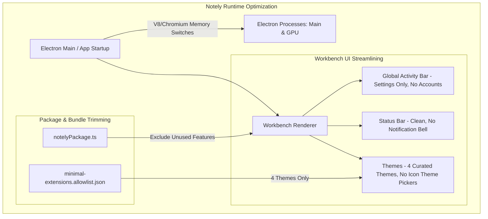

# Implementation Plan - Reduce Notely RAM Usage to ~100–150 MB & UI Streamlining

> **For agentic workers:** REQUIRED SUB-SKILL: Use superpowers:subagent-driven-development to implement this plan task-by-task. Steps use checkbox (`- [ ]`) syntax for tracking.

**Goal:** Optimize Notely to achieve a lean ~100–150 MB runtime RAM footprint (like a modern lightweight notepad) by eliminating extraneous processes, stripping the Accounts icon & authentication UI, removing the status bar notification bell, eliminating File/Product Icon theme pickers, pruning theme extensions to 4 core themes, and tuning Chromium/V8 memory flags.

**Architecture:** 
1. **UI Streamlining (Renderer Layer)**: Remove Accounts view from [globalCompositeBar.ts](file:///c:/Users/khush/Desktop/Projects/Notely/src/vs/workbench/browser/parts/globalCompositeBar.ts), remove notification status bar bell entry from [notificationsStatus.ts](file:///c:/Users/khush/Desktop/Projects/Notely/src/vs/workbench/browser/parts/notifications/notificationsStatus.ts), and remove File Icon / Product Icon picker menu items and actions from [themes.contribution.ts](file:///c:/Users/khush/Desktop/Projects/Notely/src/vs/workbench/contrib/themes/browser/themes.contribution.ts) and [minimalEditorMenus.contribution.ts](file:///c:/Users/khush/Desktop/Projects/Notely/src/vs/workbench/contrib/minimalEditor/browser/minimalEditorMenus.contribution.ts).
2. **Theme Pruning (Bundle & Package Layer)**: Restrict packaged themes in [minimal-extensions.allowlist.json](file:///c:/Users/khush/Desktop/Projects/Notely/build/minimal-extensions.allowlist.json) and [product.json](file:///c:/Users/khush/Desktop/Projects/Notely/product.json) to exactly 4 curated themes (`Dark Modern`, `Light Modern`, `Dark High Contrast`, `Solarized Dark`).
3. **Memory Tuning (Main & Runtime Layer)**: Apply V8 memory limits (`--max-old-space-size=64`, `--optimize-for-size`) and Chromium performance switches in [main.ts](file:///c:/Users/khush/Desktop/Projects/Notely/src/main.ts) / [app.ts](file:///c:/Users/khush/Desktop/Projects/Notely/src/vs/code/electron-main/app.ts) to drastically reduce initial process footprint across Main, Renderer, and GPU processes.

**Architecture Diagram:**



**Tech Stack:**
- Electron 34+ / Chromium / Node.js
- TypeScript / VS Code Minimal Workbench Architecture
- Gulp / Inno Setup (Windows Packaging)

## Global Constraints
- Target RAM: Total consumption across all Notely processes around ~100–150 MB at idle.
- Retain core notepad editing, file opening/saving, find/replace, word wrap, and line number functionality.
- Never crash on missing optional service contributions (use *Stubs Over Re-imports*).

---

### Task 1: Remove Accounts Icon and Disable Account Actions in GlobalCompositeBar

**Files:**
- Modify: [src/vs/workbench/browser/parts/globalCompositeBar.ts](file:///c:/Users/khush/Desktop/Projects/Notely/src/vs/workbench/browser/parts/globalCompositeBar.ts)

**Interfaces:**
- Consumes: `IConfigurationService`, `IStorageService`
- Produces: Streamlined activity bar with Settings gear icon only; no Accounts action or context menu items.

- [ ] **Step 1: Check existing Accounts registration in GlobalCompositeBar**
Inspect `GlobalCompositeBar` constructor to confirm `accountAction` is created and pushed to `globalActivityActionBar`.

- [ ] **Step 2: Remove Accounts Action from GlobalCompositeBar**
In [src/vs/workbench/browser/parts/globalCompositeBar.ts](file:///c:/Users/khush/Desktop/Projects/Notely/src/vs/workbench/browser/parts/globalCompositeBar.ts):
- Omit `this.globalActivityActionBar.push(this.accountAction)` when Notely is running or set `accountsVisibilityPreference` to false.
- Remove `ACCOUNTS_ACTIVITY_ID` action view item provider branches so only `GLOBAL_ACTIVITY_ID` (Settings gear) is rendered.
- Remove `toggleAccountsVisibility` from `getContextMenuActions()`.

- [ ] **Step 3: Verify compilation**
Run: `npm run compile-client`
Expected: PASS with 0 errors.

---

### Task 2: Remove Notification Bell Icon from Status Bar

**Files:**
- Modify: [src/vs/workbench/browser/parts/notifications/notificationsStatus.ts](file:///c:/Users/khush/Desktop/Projects/Notely/src/vs/workbench/browser/parts/notifications/notificationsStatus.ts)
- Modify: [src/vs/workbench/browser/workbench.ts](file:///c:/Users/khush/Desktop/Projects/Notely/src/vs/workbench/browser/workbench.ts)

**Interfaces:**
- Consumes: `INotificationsModel`, `IStatusbarService`
- Produces: Status bar without notification bell / DND badge while preserving core toast/alert dispatching.

- [ ] **Step 1: Inspect notification status bar contribution**
Check `NotificationsStatus.updateNotificationsCenterStatusItem()` in [src/vs/workbench/browser/parts/notifications/notificationsStatus.ts](file:///c:/Users/khush/Desktop/Projects/Notely/src/vs/workbench/browser/parts/notifications/notificationsStatus.ts).

- [ ] **Step 2: Suppress status bar entry creation in NotificationsStatus**
Modify `updateNotificationsCenterStatusItem()` so it does not add or update `notificationsCenterStatusItem` on `statusbarService`, or disable `NotificationsStatus` creation in [src/vs/workbench/browser/workbench.ts](file:///c:/Users/khush/Desktop/Projects/Notely/src/vs/workbench/browser/workbench.ts) when in minimal Notely mode.

- [ ] **Step 3: Verify compilation**
Run: `npm run compile-client`
Expected: PASS with 0 errors.

---

### Task 3: Remove File Icon Theme & Product Icon Theme Pickers

**Files:**
- Modify: [src/vs/workbench/contrib/themes/browser/themes.contribution.ts](file:///c:/Users/khush/Desktop/Projects/Notely/src/vs/workbench/contrib/themes/browser/themes.contribution.ts)
- Modify: [src/vs/workbench/contrib/minimalEditor/browser/minimalEditorMenus.contribution.ts](file:///c:/Users/khush/Desktop/Projects/Notely/src/vs/workbench/contrib/minimalEditor/browser/minimalEditorMenus.contribution.ts)

**Interfaces:**
- Consumes: `IWorkbenchThemeService`
- Produces: Clean Preferences menu with direct Color Theme selection only; removes `File Icon Theme` and `Product Icon Theme` commands.

- [ ] **Step 1: Inspect theme menu items in themes.contribution.ts**
Locate `SelectFileIconThemeAction` and `SelectProductIconThemeAction` registrations in [src/vs/workbench/contrib/themes/browser/themes.contribution.ts](file:///c:/Users/khush/Desktop/Projects/Notely/src/vs/workbench/contrib/themes/browser/themes.contribution.ts).

- [ ] **Step 2: Remove menu registrations for Icon Themes**
- Remove `SelectFileIconThemeAction` and `SelectProductIconThemeAction` from the Preferences menu or make them inert.
- Ensure only `Color Theme` (or `Select Theme...`) is shown in the View/Settings menus.

- [ ] **Step 3: Verify compilation**
Run: `npm run compile-client`
Expected: PASS with 0 errors.

---

### Task 4: Trim Packaged Themes to 4 Curated Core Themes

**Files:**
- Modify: [build/minimal-extensions.allowlist.json](file:///c:/Users/khush/Desktop/Projects/Notely/build/minimal-extensions.allowlist.json)
- Modify: [product.json](file:///c:/Users/khush/Desktop/Projects/Notely/product.json)

**Interfaces:**
- Consumes: Built-in theme extensions in `extensions/`
- Produces: 4 packaged themes (`theme-defaults`, `theme-solarized-dark`, `theme-quietlight`, `theme-abyss` or custom selection).

- [ ] **Step 1: Replace wildcard `theme-*` in allowlist**
In [build/minimal-extensions.allowlist.json](file:///c:/Users/khush/Desktop/Projects/Notely/build/minimal-extensions.allowlist.json), replace:
```json
"themes": ["theme-*"]
```
with:
```json
"themes": [
  "theme-defaults",
  "theme-solarized-dark"
]
```
(This includes `Dark Modern`, `Light Modern`, `Dark High Contrast`, and `Solarized Dark` — exactly 4 themes, eliminating the other 8 theme extension folders and their JSON/CSS memory loading).

- [ ] **Step 2: Update onboardingThemes in product.json**
In [product.json](file:///c:/Users/khush/Desktop/Projects/Notely/product.json), verify `onboardingThemes` matches the 4 allowed themes.

- [ ] **Step 3: Verify packaging allowlist**
Run: `npm run compile-client`
Expected: PASS with 0 errors.

---

### Task 5: Apply V8 & Chromium Process Memory Tuning Flags

**Files:**
- Modify: [src/main.ts](file:///c:/Users/khush/Desktop/Projects/Notely/src/main.ts)
- Modify: [src/vs/code/electron-main/app.ts](file:///c:/Users/khush/Desktop/Projects/Notely/src/vs/code/electron-main/app.ts)

**Interfaces:**
- Consumes: Electron `app.commandLine.appendSwitch`
- Produces: Reduced heap sizing and garbage collection frequency for Main, Renderer, and GPU processes.

- [ ] **Step 1: Add low-memory Chromium and V8 flags**
In [src/main.ts](file:///c:/Users/khush/Desktop/Projects/Notely/src/main.ts) / [src/vs/code/electron-main/app.ts](file:///c:/Users/khush/Desktop/Projects/Notely/src/vs/code/electron-main/app.ts):
```typescript
app.commandLine.appendSwitch('js-flags', '--max-old-space-size=64 --optimize-for-size');
app.commandLine.appendSwitch('disable-background-networking');
app.commandLine.appendSwitch('disable-renderer-backgrounding');
app.commandLine.appendSwitch('disable-component-update');
```

- [ ] **Step 2: Verify compilation & build**
Run: `npm run compile-client`
Expected: PASS with 0 errors.

---

### Task 6: End-to-End Packaging & Memory Verification

**Files:**
- Output: `release-artifacts/notely-1.132.0-win-x64-setup.exe`

- [ ] **Step 1: Compile all client assets**
Run: `npm run compile-client`
Expected: PASS with 0 errors.

- [ ] **Step 2: Build lean Notely Windows package**
Run: `npx gulp notely-win32-x64`
Expected: Build completed into `VSCode-win32-x64`.

- [ ] **Step 3: Generate setup installer**
Run: `npm run gulp vscode-win32-x64-inno-updater; npm run gulp vscode-win32-x64-user-setup`
Expected: Successfully compiled `VSCodeSetup.exe`.

- [ ] **Step 4: Copy to release-artifacts**
Run: `Copy-Item -Path ".build\win32-x64\user-setup\VSCodeSetup.exe" -Destination "release-artifacts\notely-1.132.0-win-x64-setup.exe" -Force`

- [ ] **Step 5: Measure Memory in Task Manager**
Launch `Notely.exe` and check working set / private memory across all processes in PowerShell / Task Manager:
`Get-Process -Name "Notely" | Measure-Object -Property WorkingSet64 -Sum`
Verify total memory is within the ~100–150 MB target.

---

## Verification Plan

### Automated Build Verification
```powershell
npm run compile-client
npx gulp notely-win32-x64
npm run gulp vscode-win32-x64-inno-updater
npm run gulp vscode-win32-x64-user-setup
```

### Manual Memory & UI Inspection
1. **UI Verification**:
   - Check Activity Bar: Verify Accounts icon is removed; only Settings gear is shown.
   - Check Status Bar: Verify notification bell icon is removed.
   - Check Settings Menu: Verify `Themes` submenu only shows `Color Theme` (no `File Icon Theme` or `Product Icon Theme`).
   - Check Theme Selection: Verify only 4 core themes are present and functional.
2. **RAM Measurement**:
   - Open Task Manager and inspect `Notely` group memory.
   - Verify total combined process memory is reduced to ~100–150 MB.
